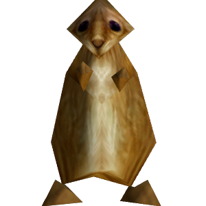

# Gophercraft/core

The Gophercraft project provides 100% Go libraries and programs for research and experimentation with MMORPG software.

# Getting started

- [Build Gophercraft core from source](./docs/INSTALL.md)

- [Set up a Gophercraft network](./docs/SETUP.md)

- [Command line reference](./docs/WIZARD.md)

# Architecture

<picture>
  <source media="(prefers-color-scheme: dark)" srcset="./docs/img/network-diagram-dark.svg">
  <source media="(prefers-color-scheme: light)" srcset="./docs/img/network-diagram-light.svg">
  
</picture>

# Versions

Gophercraft follows an All-In-One ideology (similar to AIO-Sandbox and WowPacketParser), meaning that all of its packages attempt when possible to be interoperable with many different game versions at once.

Supported versions include:

- 0.5.3.3368 (Alpha)
- 1.12.1.5875 (Vanilla)
- 2.4.3.8606 (TBC)
- 3.3.5a.12340 (WoTLK)

Support for modern protocols and formats is not yet ready, but remains in active development.